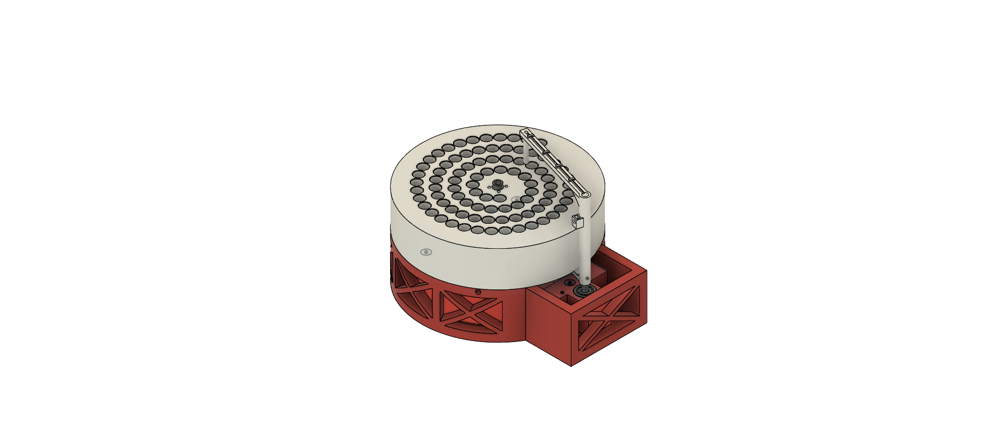
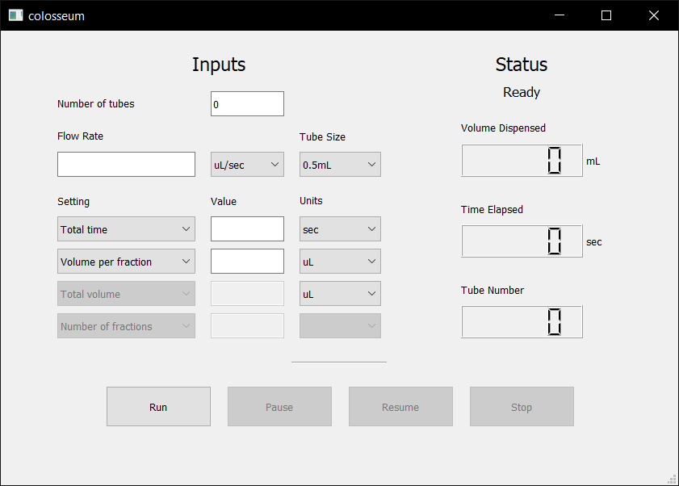

# colosseum: open source fraction collector

<p>A modular, highly customizable, open source fraction collector.</p>



## Tl;dr
We present colosseum, a low-cost, modular, and automated fluid sampling device for scalable microfluidic applications. The colosseum fraction collector can be built for less than $100 using off-the-shelf components, and can be assembled in less than an hour. It uses 3D printed parts and common components that can be easily purchased from many retailers. The device can be run from a Windows, Mac, Linux, or Raspberry Pi computer with an easy-to-use GUI.

## What's included?
<ul>
  <li>Computer Aided Design (CAD) files of the 3D printed components.</li>
  <li>Controller software (Python) and a graphical user interface (GUI) to control the motor.</li>
  <li>Arduino firmware to send commands to the motors and receive commands from the GUI.</li>
  <li>Bill of materials for sourcing and purchasing materials.</li>
  <li>Detailed assembly instructions of hardware components.</li>
  <li>Single click executable files for Mac, Windows, Linux, and Raspberry Pi systems.</li>
</ul>

## Getting Started
__What do I need to buy?__
The bill of materials with prices and vendor links is available on a [Google Spreadsheet](https://docs.google.com/spreadsheets/d/1Z83jh0TSUGW6AqqXLzAsNthaGQMtfY0oZQ2VZEOLgi0/edit?usp=sharing).

__What do I need to make?__
The 3D printed components can be fabricated on any desktop fused filament fabrication (FFF) 3D printer. They were designed using Autodesk Fusion 360, a proprietary CAD software that offers free academic licenses. STL, STEP, IGES, Fusion 360 archive files, and bill of materials are available in the HARDWARE/ folder.They can be used with any slicing software to generate GCode for 3D printing.

## Building colosseum
[This video](https://youtu.be/yG7ECh5GO0o) will guide you through the building process of colosseum.

Here are the steps for building colosseum:
1. 3D print components.
2. Attach set screws to the tube bed.
3. Insert small ball bearings into base.
4. Attach rubber feet on base.
5. Insert rotary shaft into base and fix in place with ball bearing.
6. Screw the stepper motor onto the base and attach motor couplings.
7. Screw base plate onto base.
8. Insert ball bearings into the slots on base plate.
9. Insert another rotary shaft into arm and fix with set screw.
10. Insert torsion spring into base plate and arm.
11. Slide the tube bed through the center rotary shaft and align with arm.
12. Tighten all set screws and run!

### Setting up the Arduino
We use the Arduino CNC shield to allow for up to three fraction collectors to be controlled from a computer.

The software is configured to run the stepper motors with 200 steps per revolution at 1/4 microstepping, which translates to 800 steps per rotation. To configure this, it is necessary to add a jumper between the M1 pin of the Arduino CNC shield. More information about microstepping can be found in the product page for the DRV8825 Stepper Motor Driver, which is used by the [CNC shield](http://www.zyltech.com/arduino-cnc-shield-instructions/). 

The Arduino should be flashed with the motor_serial_com.ino sketch, available in the firmware/ folder.

Make sure to download and install the [AccelStepper library](http://www.airspayce.com/mikem/arduino/AccelStepper/classAccelStepper.html). To install, unzip the zip file to the libraries sub-folder of your sketchbook, if you get stuck here is a how-to.

The fraction collector is driven by an Arduino board that interprets commands sent via USB and sends the signals to control the stepper motor movement. For directions on how to flash an arduino please refer to the official guide: https://www.arduino.cc/en/Guide/HomePage

### Setting up the hardware
We have four 3D printed parts for colosseum, which are:
<ul>
  <li> tube rack
  <li> base
  <li> base plate (support needed)
  <li> dispenser arm (support needed)
</ul>

The print parameter for these parts are as follows:
<ul>
  <li> 1.75mm diameter PLA filament 
  <li> nozzle temperature: 215°C
  <li> bed temperature of 60°C
  <li> 10% infill
  <li> 0.2mm layer height for slicing
</ul>

### Installing software
The Python scripts are available in the `SOFTWARE/` folder. The GUI was created using Qt designer, a drag and drop application for organizing buttons that allows the used to easily make modifications. This GUI is used to interface with a Python script that controls both the microscope and Arduino via USB.



First, we need to make sure some Python dependencies are properly installed on your computer. We provide a `requirements.txt` file that contains all dependencies. Open up the terminal inside the `SOFTWARE/` folder and type:
```
pip install -r requirements.txt
```

The software you will need to run on your computer in order to control the Arduino is the `run.py` script located in the `SOFTWARE/` folder. To start up the UI, open up the terminal inside the folder with all of the .py and .ui files, and type:
```
python run.py
```
Before you run the system, MAKE SURE YOU HAVE INSTALLED THE ARDUINO FIRMWARE!!

## Startup Checklist
Before starting the Python controller, make sure
<ul>
  <li> The Arduino has the firmware uploaded to it
  <li> The Arduino is connected via USB to the computer
  <li> You have appropriately placed jumpers on the CNC Shield to allow for microstepping and hardware enabling (discussed in build video).
  <li> The CNC shield is powered, and that all motors are plugged in to the CNC shield
</ul>

## Tips/Hints
Things that we have learned along the way that may help with your build.
